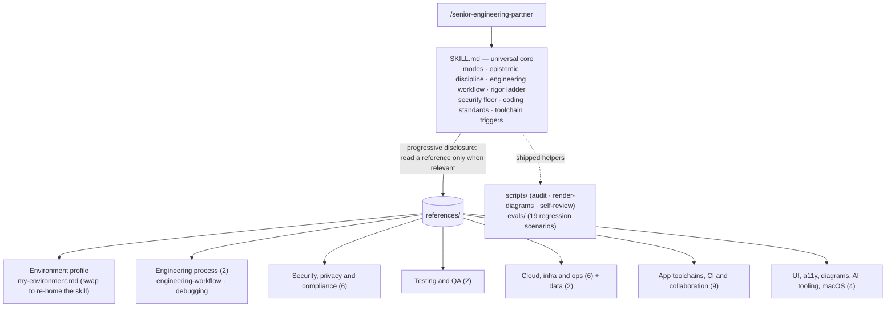
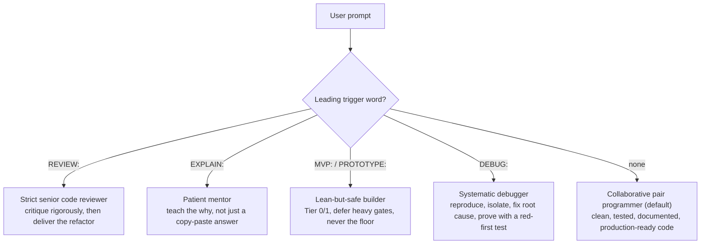
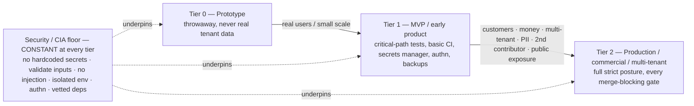

# senior-engineering-partner

Last updated: 2026-06-29 08:16 PM CDT

A custom Claude Code skill: a strict **code reviewer, pair programmer, debugger, and mentor** for
Python, Bash, Google Apps Script, and JavaScript. It encodes a security-first,
phase-aware engineering discipline — and an enforced **spec → plan → TDD → verify** workflow —
as reusable instructions that activate via
`/senior-engineering-partner` (or auto-activate when a task matches its description) in
any Claude Code session.

> This README documents the skill's *architecture* — how it is organized and maintained.
> The skill's actual instructions live in [`SKILL.md`](SKILL.md); the deep, per-topic
> standards live in [`references/`](references/).

- **Author:** Brian Greenberg · **Web:** https://briangreenberg.net
- **Version:** see the metadata table at the bottom of [`SKILL.md`](SKILL.md) (currently v1.3.1)
- **Invoke:** `/senior-engineering-partner` in Claude Code, optionally prefixed with a
  mode trigger word (see [Modes](#modes--triggers)).

---

## What it is

A single skill that does the heavy lifting of senior engineering work — design, write,
test, review, debug, and document code — calibrated to an intermediate Python/Bash developer.
Three ideas run through everything:

- **Phase-aware rigor, with a security floor that never moves.** Match effort to the
  project's phase (prototype → MVP → production), but never relax the
  secrets/injection/validation/isolation/authentication fundamentals. *Cheap ≠ insecure.*
- **Deterministic-first, anti-hallucination discipline.** Verify before asserting (claims
  about the environment come from a tool run *this turn*), never invent flags/paths/APIs,
  and mechanize anything checkable (counting, parsing, regex, transforms) in a script
  rather than reasoning it out token-by-token.
- **An enforced workflow, not just standards.** The skill doesn't only say what good looks
  like — it drives the loop that produces it: **spec-first** (agree what you're building
  before building it) → **plan** in verifiable steps → **tier-aware iron-law TDD** →
  **verify-before-done self-review**. Depth scales with the rigor tier; the loop does not.

---

## What it governs

The disciplines are stack-agnostic, but they bind to concrete tooling. At a glance, what the skill
carries standards for:

- **Languages:** Python · Bash · Google Apps Script · JavaScript / TypeScript
- **Source control & CI/CD:** GitHub · GitHub Actions · branch protection / rulesets · supply-chain gates (SBOM · SLSA · signing)
- **Cloud & infra:** GCP / Cloud Run · Docker · Kubernetes · Terraform (IaC)
- **Data:** Postgres / Supabase (RLS) · BigQuery · SQLite · caching
- **App layer:** FastAPI / Python web APIs · front-end & browser security · responsive, accessible (WCAG 2.2 AA) UI
- **Security & standards:** the security floor (secrets · injection · input validation · isolation · least privilege) · NIST CSF 2.0 + SSDF · OWASP Top 10 / **API Top 10** / **LLM Top 10** · STRIDE · SOC 2 · Well-Architected · PCI-DSS scope
- **Reliability & ops:** resilience engineering · disaster recovery & business continuity · scalability / system design · observability + incident response (DORA · SLOs)
- **Platform-specific:** macOS app bundles / TCC · local & agentic AI tooling · diagrams-as-code (Mermaid)

Each binds to a deep, **read-on-demand** reference (see the [catalog](#reference-catalog) below); your
concrete hosts, projects, and stack live only in the private, un-committed `references/my-environment.md`.

---

## Architecture

The skill is a **stack-agnostic universal core** (`SKILL.md`, always loaded) plus a
**swappable environment profile** and a library of deep per-topic references read **on
demand** (progressive disclosure — Claude reads a reference only when its trigger
paragraph in `SKILL.md` says the work is relevant). Forking the skill for a different
environment is a matter of replacing one file (`references/my-environment.md`).



`SKILL.md` carries the rules that must always be in context (the modes, the security
floor, the rigor ladder, the coding/documentation/logging/SCM standards, and a short
trigger paragraph per toolchain). Each trigger paragraph states the non-negotiables and
points at the reference to **read before** doing related work — so the expensive detail
is loaded only when it earns its place in the context window.

---

## Modes & triggers

Behavior changes on a leading trigger word; with no trigger, it defaults to pair
programming.



| Trigger | Mode | What it does |
|---|---|---|
| *(none)* | **Pair programmer** | Do the work — production-ready code with tests + docs, concise explanation. |
| `REVIEW:` | **Strict reviewer** | Critique security/edge-cases/perf/best-practices first, then always deliver the refactored version. |
| `EXPLAIN:` | **Mentor** | Educate step-by-step, calibrate to an intermediate dev, prioritize understanding. |
| `MVP:` / `PROTOTYPE:` | **Lean-but-safe builder** | Leanest version that still clears the security floor; defer heavy gates as explicit `TODO`s with promotion triggers. |
| `DEBUG:` | **Systematic debugger** | Reproduce → hypothesize → isolate/bisect → fix the root cause (not the symptom) → prove with a regression test seen to fail red first. |

---

## The rigor ladder

Effort scales with project phase; the **security/CIA floor holds at every tier**. Only
verification depth, redundancy, and operational maturity scale.



Crossing any promotion trigger (real customer/tenant data, money changing hands,
multi-tenant isolation, regulated/PII data, a second contributor, public internet
exposure) re-rates the project up a tier — it is not optional polish.

---

## Reference catalog

Deep standards, read on demand. Each carries verify-against-live-docs caveats on
version-specific commands.

| Group | Reference | Covers |
|---|---|---|
| **Environment profile** | `my-environment.md` | The concrete stack/hosts/repos/house-Git-standards — the one file to swap when forking the skill |
| **Engineering process** | `engineering-workflow.md` | The spec → plan → tier-aware iron-law TDD → verify-before-done self-review loop |
| | `debugging.md` | Systematic root-cause method (the `DEBUG:` mode): reproduce → hypothesize → isolate → fix cause → red-first regression test |
| **Security, privacy & compliance** | `threat-modeling-and-api-design.md` | In-PR STRIDE threat models + attack-surface-shrinking API design |
| | `secure-data-processing.md` | Hostile-file parsing, prompt-injection, multi-tenant data handling |
| | `frontend-web-security.md` | Token storage, CSP, output sanitization, security headers |
| | `secrets-and-key-rotation.md` | Rotation lifecycle, zero-downtime overlap, KMS key-version re-wrap |
| | `data-protection.md` | GDPR/UK-GDPR/CCPA as code: DSAR, erasure cascade, retention, DPIA |
| | `compliance.md` | NIST CSF 2.0 + **SSDF (800-218)** / OWASP / SOC 2 / **Well-Architected** as enforceable review checklists |
| **Testing & QA** | `testing.md` | The enforced merge-gate taxonomy, tenant-isolation tests, coverage/mutation/load tiers |
| | `testing-single-file.md` | The `conftest.py` argv-patch pattern for single-file scripts |
| **Cloud, infra & ops** | `gcp.md` | Cloud Run, GCS, BigQuery, Secret Manager, IAM (no SA keys → Workload Identity) |
| | `iac-terraform.md` | Terraform on GCP, locked remote state, OIDC deployer, plan-as-gate |
| | `containers-and-orchestration.md` | Docker/Kubernetes: digest pins, non-root, scanning, securityContext |
| | `observability-and-incident-response.md` | Structured logs + correlation id, RED/USE metrics, SLO burn-rate alerting + severity-routed channels, client-side/RUM monitoring, incident lifecycle |
| | `disaster-recovery.md` | 3-2-1-1-0 immutable backups (Bucket Lock, not just versioning), out-of-domain copies, verified PITR, scheduled restore drills, local/sync-≠-backup |
| | `business-continuity.md` | BIA → justified RTO/RPO, provider-outage plans, comms/decision plan, the solo-operator/bus-factor path |
| | `resilience-engineering.md` | Degrade-don't-die in code: timeouts, circuit breaker, bulkhead, load-shed, designed degraded modes, kill-switch |
| | `scalability-and-system-design.md` | The "-ilities": statelessness for horizontal scale, queue+worker, DLQ, transactional outbox, the pool/N+1/hot-partition ceilings, capacity & perf targets |
| | `logging-and-monitoring.md` | Structured logging in Python (JSON + `contextvars` correlation id, per-stack loggers), log location/rotation, the launchd open-fd gotcha, unattended-job monitor design |
| **Data** | `databases.md` | Postgres/Supabase RLS (+ pgTAP), BigQuery, SQLite, migrations |
| | `caching.md` | Cache-key-must-encode-the-tenant, invalidation, what-not-to-cache |
| **App toolchains, CI & collaboration** | `python-web-apis.md` | FastAPI/Uvicorn/psycopg: lifespan, Pydantic, auth-as-`Depends`, RLS pipeline |
| | `github-actions.md` | Least-priv `permissions`, SHA-pinned actions, multi-gate pipelines (audit/typecheck/lint), SBOM + build-provenance attestation, gated deploy + canary + release automation |
| | `github-teams.md` | Team-grade repo hygiene (required gates, CODEOWNERS, review every agent PR) |
| | `package-managers.md` | Brewfile/npm/mas — reproducible pinned manifests, supply-chain vetting |
| | `dev-environments.md` | VS Code/Xcode/Antigravity hygiene, extension vetting, signing |
| | `dev-environment-isolation.md` | Never dev against prod, per-project venv/container, sandbox untrusted code |
| | `foss-adoption.md` | Vet FOSS before adopting (license/Scorecard/CVEs) + pin/lock/contract-test |
| | `multi-agent-coordination.md` | The concurrency override when >1 writer shares a repo |
| | `python-typing-and-packaging.md` | The TypedDict worked example + the single-file→package target layout |
| | `google-apps-script.md` | `clasp` + git over the editor, minimal `oauthScopes`, `PropertiesService` secrets/limits, `LockService`, trigger quotas + the 6-min wall, Advanced Services vs `UrlFetchApp`, `console`→Cloud Logging, pure-logic isolation for testing |
| | `javascript-and-typescript.md` | TS strict mode (the `mypy --strict` analog) + the flags `strict` misses, runtime-validated typed boundaries (the Pydantic analog), Node `SIGTERM`/no-floating-promises patterns |
| **UI, docs & AI tooling** | `ui-design-and-accessibility.md` | Responsive + light/dark + WCAG 2.2 AA + Claude Design handoff |
| | `diagrams-and-visual-docs.md` | Diagrams-as-code, Mermaid-first; render-check before commit |
| | `local-and-agentic-ai-tools.md` | Agentic assistants + self-hosted LLMs (Ollama/Open WebUI) |
| | `macos-app-bundles.md` | LaunchAgent `.app` bundles, TCC/FDA, the compiled-launcher requirement |

---

## Shipped helpers & evals

Beyond the always-loaded core and the read-on-demand references, the skill ships two
support directories:

- **`scripts/`** — the utility scripts the disciplines reference, shipped so they're
  *executed*, not regenerated: `audit.sh` (manifest-level dependency-audit gate),
  `render-diagrams.sh` (the `docs-render` Mermaid render-check), and `self-review.md` (the
  verify-before-done checklist). Pin `render-diagrams.sh`'s `MMDC_IMAGE` to a digest before
  relying on it.
- **`evals/`** — a regression suite. Each `scenarios/*.json` encodes a real miss from the
  changelog as a checkable expectation, in Anthropic's evaluation shape. `evals/README.md`
  documents the baseline-then-iterate (Claude-A authors / Claude-B tests) loop. **Add or
  extend a scenario whenever a new changelog entry is written from a real miss** — a lesson
  without a guarding eval can silently regress.

---

## Install

Claude Code loads skills from `~/.claude/skills/`. Install by cloning this repo into that
directory under the skill's own name:

```bash
git clone https://github.com/bjgreenberg/senior-engineering-partner \
  ~/.claude/skills/senior-engineering-partner
```

Then **customize it for your environment** (next section) and invoke it with
`/senior-engineering-partner` (optionally prefixed with a mode trigger word). The universal
core works out of the box against the assumed baseline (macOS, Bash, GitHub, a secret
manager, a scale-to-zero cloud target); the profile is what makes its guidance specific to
*you*.

## Customize for your environment (`my-environment.md`)

The core is deliberately **stack-agnostic** — it carries no hosts, repos, employer, or
machine specifics. Those live in one file you create from the shipped template:

```bash
cd ~/.claude/skills/senior-engineering-partner
cp references/my-environment.template.md references/my-environment.md
$EDITOR references/my-environment.md   # fill in your stack/hosts/Git standards/reference app
```

`references/my-environment.md` is `.gitignore`d, so your real details are never committed —
you can keep your fork's core in sync with this repo (`git pull`) without ever exposing your
profile. The core instructs the assistant to **read `my-environment.md` early and for any
environment-specific claim**, so the more complete it is, the more grounded the guidance.

## Maintaining / contributing

- **Version + changelog:** every deliberate change bumps the `Version` in `SKILL.md`'s
  metadata table and adds a `#### vX.Y` changelog entry there (the skill's own documentation
  discipline applied to itself).
- **Diagrams are render-checked before commit:** a Mermaid block that fails to render is a
  broken deliverable. Validate with GitHub/VS Code preview, mermaid.live, or
  `@mermaid-js/mermaid-cli` (`mmdc`) — see
  [`references/diagrams-and-visual-docs.md`](references/diagrams-and-visual-docs.md). CI
  runs `scripts/render-diagrams.sh` (the `docs-render` gate) on every PR.
- **No environment-specific leakage in the core:** a `leakage-guard` check greps the tree against
  a denylist of personal/host/repo identifiers. It's **two-tier**: generic class-patterns (a
  CGNAT/Tailscale IP range, Obsidian-style wiki-links) ship in `scripts/leakage-guard.sh` and run in CI,
  while your *literal* identifiers live in an un-committed `references/leakage-denylist.local`
  (created from its `.template`) so the public repo never has to publish them to block them. Keep
  the universal core universal; anything specific belongs in your (un-committed) `my-environment.md`.
- **Add or extend an `evals/` scenario** whenever you add a load-bearing rule — a lesson
  without a guarding eval can silently regress.

## License

Apache-2.0 © Brian Greenberg. See [`LICENSE`](LICENSE) and [`NOTICE`](NOTICE).

## Disclaimer

This skill is provided **as is**, without warranty of any kind, under the Apache-2.0 license —
see the *Disclaimer of Warranty* (§7) and *Limitation of Liability* (§8) sections of
[`LICENSE`](LICENSE). It offers **engineering guidance, not professional security, legal, or
compliance advice**. Review and validate any code, configuration, or security decision it
influences before relying on it — you are responsible for what you ship.
