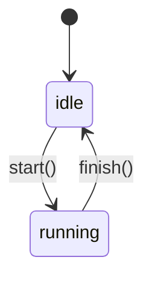

# sync-job

Last updated: 2026-06-20 09:12 AM CDT

A tiny sync job driven by an explicit state machine (`sync.py`).

## Lifecycle

## How a sync run works

1. The job starts in `idle`.
2. `start()` moves it to `running`; invalid transitions raise `RuntimeError`.
3. `finish()` returns it to `idle`, ready for the next run.
