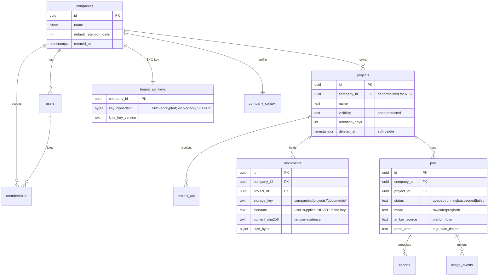
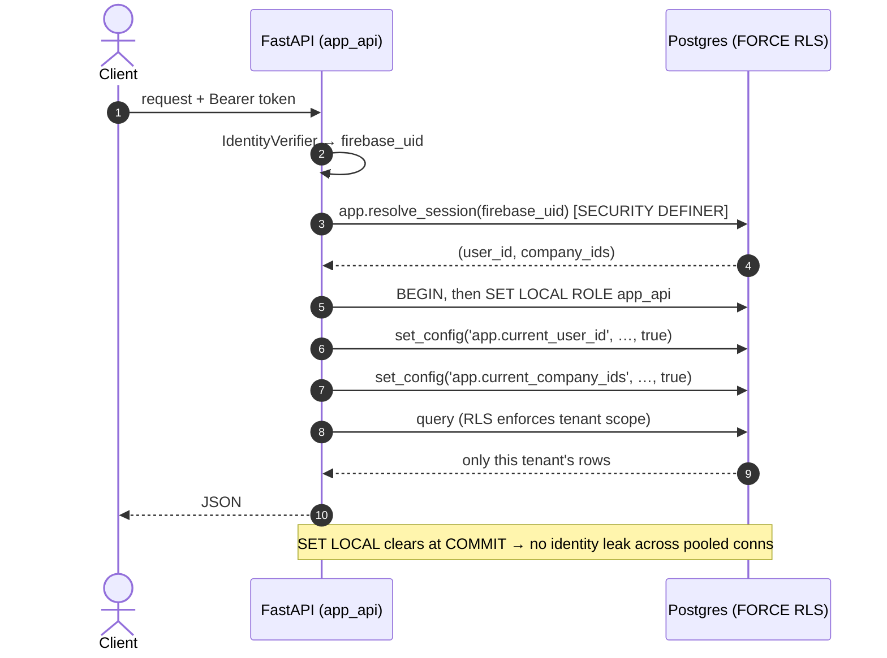
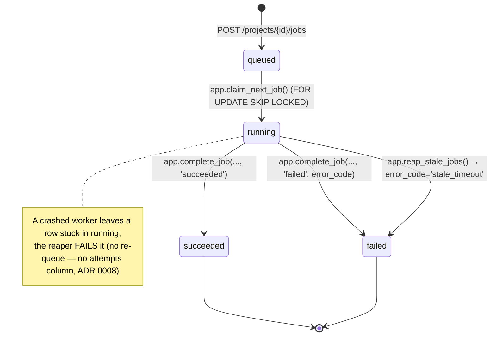
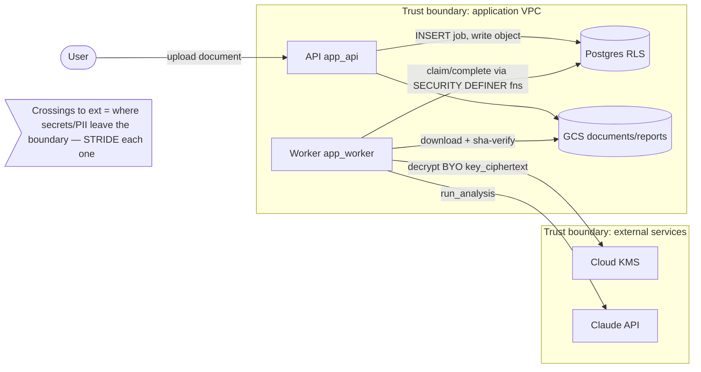
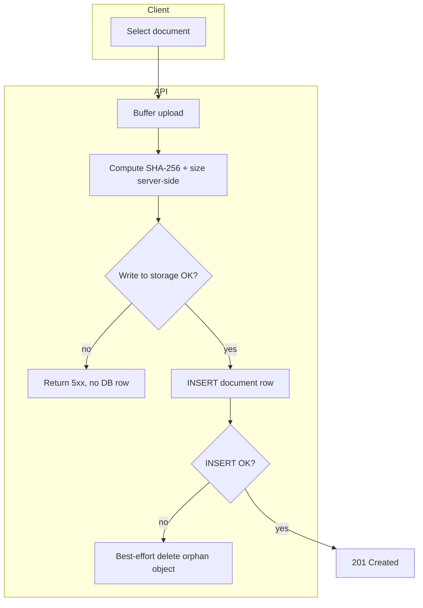

# Diagrams & Visual Documentation

The discipline: a non-trivial system carries **diagrams-as-code**, **Mermaid-first**, living
next to the thing they document and rendering on GitHub. A diagram is documentation that a
diff can review and that cannot silently rot the way a screenshot or a Lucidchart export does.
This reference is the full standard behind the SKILL.md DOCUMENTATION bullet — read it before
producing a data model, a data dictionary, a process/data-flow/sequence/state diagram, an
architecture view, or a storyboard.

> **Verify-against-live-docs caveat.** Mermaid's syntax evolves and GitHub pins a specific
> Mermaid version in its renderer; some diagram types (`C4Context`, newer `block`/`packet`
> types) render in mermaid.live before they render on GitHub. When a fenced ```mermaid block
> fails to render on GitHub, check the [Mermaid docs](https://mermaid.js.org) for the type's
> support status rather than assuming the syntax is wrong — and keep a plain-text fallback
> (a table or list) for anything that must be readable even when unrendered.

---

## Decision: Mermaid-first

**Mermaid is the default** for every structural and behavioral diagram. It wins for this stack because:

- **Renders natively on GitHub** inside any `.md` — READMEs, ADRs, PR descriptions — with zero tooling to view.
- **Diffable and version-controlled** plain text: no binary blobs, reviews show exactly what changed, and the diagram lives in the repo next to the code it describes (the same ethos as ADRs).
- **Authorable directly** in fenced ```mermaid blocks — cheap for an agent or a human to keep current, so it actually stays current.
- **Editors render it live:** GitHub, VS Code (Mermaid extension), Obsidian, and [mermaid.live](https://mermaid.live) for ad-hoc work.

The cost of a diagram that lives in a separate tool is that nobody updates it; Mermaid removes
that excuse. **Keep the diagram in the same PR as the change it reflects** — a schema migration
that doesn't touch the ERD is an incomplete PR, exactly like one that doesn't touch the CHANGELOG.

### When Mermaid is NOT the right tool

- **Visual storyboards / UI mockups / wireframes** → Mermaid cannot draw fidelity UI. Use the
  **Claude Design → Claude Code handoff** path (see `references/ui-design-and-accessibility.md`)
  or the `mcp__visualize__show_widget` (SVG/HTML) tool for frame-by-frame panels. Mermaid's
  `journey` type covers the *user-journey abstraction* (the logical layer of a storyboard), but
  the actual UI frames need image/SVG. Treat any generated frames as agent-authored code through
  the same review + a11y gates.
- **Data dictionary** → a **Markdown table** (or one generated from the live schema), not a
  diagram. The ERD shows shape and relationships; the dictionary is the field-level authority.
- **Large / fast-moving ERDs** → consider **generating** the diagram from the database
  (Postgres catalog → `dbml`, SchemaSpy, `mermerd`, or similar) rather than hand-maintaining a
  big `erDiagram`. Hand-author small/stable models; generate large/churning ones so they can't drift.

---

## Taxonomy — artifact → tool → when to use

| Artifact | Tool | Mermaid type / format | Use it for |
|---|---|---|---|
| **Data model / ERD** | Mermaid | `erDiagram` | tables, columns, keys, relationships, cardinality |
| **Data dictionary** | Markdown table | table | the field-level reference (column, type, null, default, constraints, PII?, description); pairs with the ERD |
| **DFD (data-flow)** | Mermaid | `flowchart` with **trust-boundary** subgraphs | how data moves across processes/stores/external entities — the STRIDE/threat-model staple (cross-ref `references/threat-modeling-and-api-design.md`) |
| **PFD / process flow** | Mermaid | `flowchart` | business/process steps, decisions, swimlanes (subgraphs) |
| **Sequence / interaction** | Mermaid | `sequenceDiagram` | request flows (auth→session-GUC→RLS; worker claim→download→analyze→complete) |
| **State machine / lifecycle** | Mermaid | `stateDiagram-v2` | object lifecycles (job status, soft-delete→purge) |
| **Architecture (C4)** | Mermaid | `C4Context`/`C4Container` or `flowchart` | system/container/component context; complements ADRs |
| **Roadmap / timeline** | Mermaid | `gantt` | milestone planning |
| **User journey** | Mermaid | `journey` | UX-flow abstraction (the storyboard's logical layer) |
| **Storyboard (UI frames)** | Claude Design / SVG-HTML widget | frame panels + annotations | step-by-step UI walkthroughs (NOT Mermaid) |

Beyond the artifacts most teams ask for by name (ERD, data dictionary, PFD, DFD, storyboard),
**reach for sequence diagrams, state diagrams, C4 views, and DFD-with-trust-boundaries** wherever
they earn their place — the last one folds the threat model into a picture. ADRs and runbooks are
already covered elsewhere in the skill; a diagram complements an ADR, it doesn't replace its prose.

---

## Worked examples (grounded in an example multi-tenant SaaS)

These are copy-pasteable starting points. Adapt the entities/steps to the system at hand.

### ERD — `erDiagram`



Note in prose what the diagram can't carry: every tenant table has a **denormalized `company_id`**
driving FORCE'd RLS; `tenant_api_keys.key_ciphertext` is **never** granted to `app_api` (column-level
GRANT, worker-only). The ERD shows shape; the security model is a sentence beneath it.

### Data dictionary — Markdown table (pairs with the ERD)

Per table, the authoritative field reference. Flag PII explicitly — it drives the data-protection
and erasure-cascade work (`references/data-protection.md`).

| Column | Type | Null | Default | Constraints | PII? | Description |
|---|---|---|---|---|---|---|
| `id` | `uuid` | no | `gen_random_uuid()` | PK | no | Document id |
| `company_id` | `uuid` | no | — | FK→companies, RLS key | no | Owning tenant (denormalized) |
| `project_id` | `uuid` | no | — | FK→projects | no | Owning project |
| `storage_key` | `text` | no | — | unique | no | GCS object key; tenant-scoped path |
| `filename` | `text` | no | — | — | **maybe** | User-supplied name; may name a person |
| `content_sha256` | `text` | no | — | 64 hex | no | Tamper-evidence hash, re-verified on read |
| `size_bytes` | `bigint` | no | — | `>= 0` | no | Byte length at upload |

### Sequence — `sequenceDiagram` (auth → RLS pipeline)



### State machine — `stateDiagram-v2` (job lifecycle, incl. the reaper)



### DFD with trust boundaries — `flowchart` (the threat-model staple)



Each arrow that crosses a `subgraph` boundary is a place to apply STRIDE; annotate the crossings,
not the interior. This is the diagram form of the in-PR threat model.

### Process flow — `flowchart` with swimlanes (document intake)



### Architecture (C4) and roadmap — `C4Container` / `gantt`

Use `C4Container` (or a plain `flowchart` if GitHub's renderer lags the C4 syntax) for the
system-context view that complements your ADRs, and `gantt` for milestone timelines. Keep these
high-level — they exist to orient a new contributor, not to track every component.

---

## Storyboards (UI frames) — NOT Mermaid

For any UX-bearing feature, produce a **storyboard**: ordered UI frames with annotations showing
the user's path through the change. Mermaid's `journey` captures the *logical* steps; the *visual*
frames come from **Claude Design** (handed to Claude Code per `references/ui-design-and-accessibility.md`)
or the `mcp__visualize__show_widget` SVG/HTML tool for quick wireframes. The output is agent-authored
code: it goes through the same review and the WCAG 2.2 AA / axe / Lighthouse / keyboard / screen-reader
gates as any UI deliverable. Pair the visual frames with a one-line caption per frame so the
storyboard is legible in a PR even before anyone renders it.

---

## Authoring pitfalls (validate before committing)

Mermaid fails the *whole* block with a red "Unable to render" box on a syntax slip, so
**render every diagram before committing** — GitHub itself, VS Code's Mermaid preview,
[mermaid.live](https://mermaid.live), or `@mermaid-js/mermaid-cli` (`mmdc`) in CI. The
bites that recur:

- **Comments must be on their own line.** `%%` is only a comment at the start of a line;
  an inline `… %% note` is non-standard — put the aside in the message text or a `Note`.
- **`;` is a statement separator, not punctuation.** In a `sequenceDiagram` message,
  `API->>DB: BEGIN; SET ROLE x` is parsed as two statements and errors. Use a comma/word
  ("BEGIN, then SET ROLE x"). (Inside quoted `erDiagram` comments and `note … end note`
  bodies a `;` is fine — it's only bare message/edge text that splits.)
- **Reserved-ish words and unbalanced brackets** in node text break `flowchart`/`state`
  parsing — quote the label (`A["text (with parens)"]`) when in doubt.
- **GitHub pins a Mermaid version** that can lag mermaid.live — if a block renders there
  but not on GitHub, check the type's support status and keep the plain-text fallback.

**Quality gate — render-check before commit (treat it like a failing test).** Don't ship a
diagram you haven't seen render. To validate every fenced block in a file headlessly (the
same engine GitHub uses), extract the blocks and run `mmdc`:

```bash
# one-time: mmdc needs a headless browser
npx -y puppeteer browsers install chrome-headless-shell
# extract ```mermaid blocks → tmp files, render each; a non-zero exit / missing SVG = a broken block
python3 - "$FILE" <<'PY'
import re, sys, pathlib
blocks = re.findall(r"```mermaid\n(.*?)```", pathlib.Path(sys.argv[1]).read_text(), re.S)
for i, b in enumerate(blocks, 1): pathlib.Path(f"/tmp/mmd_{i}.mmd").write_text(b)
print(len(blocks))
PY
for f in /tmp/mmd_*.mmd; do npx -y @mermaid-js/mermaid-cli mmdc -i "$f" -o "${f%.mmd}.svg" || echo "BROKEN: $f"; done
```

Wire this into CI for any repo whose docs carry Mermaid, so a diagram that fails to render
can't merge — exactly the bug this discipline exists to catch.

**Make `docs-render` a REQUIRED status check** (branch protection / ruleset), not a green-optional
job. The same logic that gates merges on a failing test applies here: an unrenderable diagram is a
broken deliverable, the render is cheap (a digest-pinned `mermaid-cli` container, ~tens of seconds,
no host toolchain), and the failure mode it catches — a red "Unable to render" box asserting a blank
or wrong model to every reader — is precisely what this discipline exists to prevent. Advisory-only
lets exactly that bug merge. The house pattern is a self-contained `scripts/render-diagrams.sh` that
renders **every** `` ```mermaid `` block in the repo's Markdown via the digest-pinned container
(`ghcr.io/mermaid-js/mermaid-cli/mermaid-cli@sha256:99c983b3…`, tag 11.4.2 — bump-and-re-pin
deliberately; Dependabot doesn't track it), shared verbatim by the local pre-commit run and the CI
`docs-render` job. Promote it to required once green, alongside the test/build gates.

## Keeping diagrams honest (anti-rot)

- **Co-locate** the diagram with what it documents: ERD + data dictionary in `db/README.md`,
  lifecycle in the relevant service README/ADR, request flows in the API README.
- **ALWAYS update the diagram when what it depicts changes — in the same commit.** A diagram in
  a stale state is worse than none: it asserts the old model with authority. When you change a
  flow, schema, lifecycle, or architecture, hunt down *every* diagram **and every numbered
  process/step list** describing the touched path and bring it current — don't stop at the prose.
  (Real miss this was written from: a feature's prose + CHANGELOG were updated but its
  automation-flow diagram and step-list still showed the superseded flow.)
- **Generate the volatile ones.** If an ERD changes every sprint, generate it from the schema in
  CI rather than hand-editing; hand-authoring is for small, stable, or intentionally-abstracted views.
- **Plain-text fallback.** Because GitHub pins a Mermaid version, keep critical information (the
  data dictionary, the threat-model crossings) also expressible as text, so nothing is lost if a
  block fails to render.
